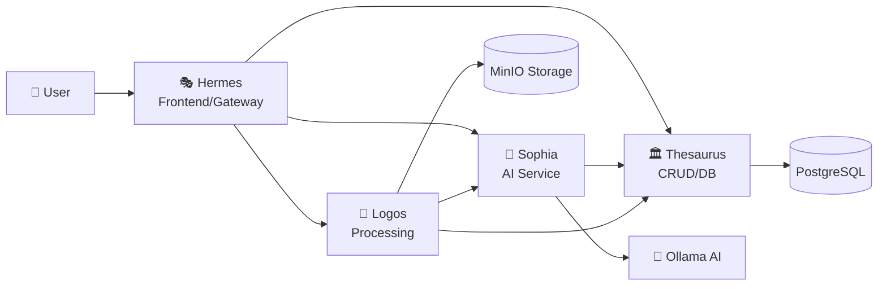

# LocalFinance Microservices Architecture

## 🏛️ **Four Greek Services**

LocalFinance is now organized as a modern microservices architecture with four core services, each named after Greek concepts:

### **🎭 Hermes** - Frontend & API Gateway
**Greek Origin:** Hermes (Ἑρμῆς) - Messenger of the gods, guide between worlds  
**Purpose:** User-facing interface and communication orchestration  
**Port:** 3000  
**Technology:** Go + Gin (API Gateway) + React (Frontend)

### **🏛️ Thesaurus** - CRUD/Database Service  
**Greek Origin:** Thesaurus (θησαυρός) - Treasury, storehouse of wealth  
**Purpose:** Data persistence layer and database operations  
**Port:** 8001  
**Technology:** Go + Gin + PostgreSQL + GORM + Redis

### **🦉 Sophia** - AI Service
**Greek Origin:** Sophia (σοφία) - Wisdom, divine knowledge  
**Purpose:** AI-powered insights and question answering  
**Port:** 8002  
**Technology:** Go + Gin + Ollama + llama3.2:1b

### **📜 Logos** - Document Processing Service
**Greek Origin:** Logos (λόγος) - Reasoning, logic, structured thought  
**Purpose:** Document parsing, analysis, and data extraction  
**Port:** 8003  
**Technology:** Go + Gin + MinIO + PDF/CSV parsers

---

## 🚀 **Quick Start**

### **Prerequisites**
- Docker & Docker Compose
- Go 1.21+ (for development)
- Node.js 18+ (for frontend development)

### **Start All Services**
```bash
# Clone the repository
git clone https://github.com/sagarjhaa/localfinance.git
cd localfinance

# Start all services with Docker Compose
docker-compose -f deployment/docker/docker-compose.yml up -d

# View logs
docker-compose -f deployment/docker/docker-compose.yml logs -f
```

### **Access Points**
- **Frontend**: http://localhost:3000
- **API Gateway**: http://localhost:3000/api
- **Thesaurus API**: http://localhost:8001/api/v1
- **Sophia AI API**: http://localhost:8002/api/v1
- **Logos Processing API**: http://localhost:8003/api/v1
- **MinIO Console**: http://localhost:9001 (admin/minioadmin)
- **Grafana**: http://localhost:3001 (admin/admin)

---

## 📁 **Repository Structure**

```
localfinance/
├── services/                    # Microservices
│   ├── hermes/                 # 🎭 Frontend & API Gateway
│   │   ├── main.go
│   │   ├── api/gateway.go
│   │   ├── config/
│   │   └── frontend/           # React app (to be created)
│   ├── thesaurus/              # 🏛️ CRUD/Database Service
│   │   ├── main.go
│   │   ├── api/handlers/
│   │   ├── models/
│   │   ├── database/
│   │   └── config/
│   ├── sophia/                 # 🦉 AI Service
│   │   ├── main.go
│   │   ├── ai/service.go
│   │   ├── models/
│   │   └── config/
│   └── logos/                  # 📜 Document Processing
│       ├── main.go
│       ├── processors/
│       ├── models/
│       ├── storage/
│       └── config/
├── shared/                     # Shared utilities
│   ├── models/
│   ├── utils/
│   └── config/
├── deployment/                 # Deployment configurations
│   ├── docker/
│   │   ├── docker-compose.yml
│   │   └── *.Dockerfile
│   ├── kubernetes/
│   └── scripts/
└── legacy/                     # Original Python prototypes
    ├── enhanced_hisab_bot.py
    ├── document_processor.py
    └── dashboard/
```

---

## 🔄 **Service Communication Flow**



### **Communication Patterns**
1. **User → Hermes**: Web interface + API gateway
2. **Hermes → Services**: HTTP REST API calls
3. **Logos → Sophia**: AI categorization of transactions
4. **Logos → Thesaurus**: Store processed transaction data
5. **Sophia → Thesaurus**: Query user data for AI context

---

## 🛠️ **Development**

### **Run Individual Services (Development)**

#### **Thesaurus (Database Service)**
```bash
cd services/thesaurus
export DB_HOST=localhost DB_NAME=localfinance DB_USER=postgres DB_PASSWORD=password
go run main.go
# Access: http://localhost:8001
```

#### **Sophia (AI Service)**
```bash
cd services/sophia
export OLLAMA_HOST=http://localhost:11434 THESAURUS_URL=http://localhost:8001
go run main.go
# Access: http://localhost:8002
```

#### **Logos (Document Processing)**
```bash
cd services/logos
export STORAGE_ENDPOINT=localhost:9000 THESAURUS_URL=http://localhost:8001
go run main.go
# Access: http://localhost:8003
```

#### **Hermes (Frontend & Gateway)**
```bash
cd services/hermes
export THESAURUS_URL=http://localhost:8001 SOPHIA_URL=http://localhost:8002 LOGOS_URL=http://localhost:8003
go run main.go
# Access: http://localhost:3000
```

---

## 📡 **API Documentation**

### **Thesaurus API (Database Operations)**
```bash
# Users
POST   /api/v1/users                    # Create user
GET    /api/v1/users/:id                # Get user
PUT    /api/v1/users/:id                # Update user
DELETE /api/v1/users/:id                # Delete user

# Accounts
POST   /api/v1/accounts                 # Create account
GET    /api/v1/accounts/:id             # Get account
GET    /api/v1/accounts/user/:userId    # Get user accounts

# Transactions
POST   /api/v1/transactions             # Create transaction
GET    /api/v1/transactions             # List transactions (with filters)
GET    /api/v1/transactions/:id         # Get transaction
PUT    /api/v1/transactions/:id         # Update transaction
DELETE /api/v1/transactions/:id         # Delete transaction
GET    /api/v1/transactions/summary     # Get spending summary
POST   /api/v1/transactions/search      # Advanced search

# Budgets
POST   /api/v1/budgets                  # Create budget
GET    /api/v1/budgets/:id              # Get budget
GET    /api/v1/budgets/user/:userId     # Get user budgets
```

### **Sophia AI API**
```bash
POST   /api/v1/chat                     # Ask financial question
POST   /api/v1/categorize               # Categorize transaction
POST   /api/v1/insights                 # Get financial insights
GET    /api/v1/insights/:userId         # Get user insights
POST   /api/v1/analyze                  # Analyze spending patterns
```

### **Logos Processing API**
```bash
POST   /api/v1/upload                   # Upload document for processing
GET    /api/v1/status/:jobId            # Get processing status
GET    /api/v1/documents                # List processed documents
GET    /api/v1/documents/:id            # Get document details
POST   /api/v1/process                  # Process uploaded file
GET    /api/v1/stats                    # Get processing statistics
```

---

## 🗄️ **Database Schema**

### **PostgreSQL Tables (Thesaurus)**
```sql
-- Users table
CREATE TABLE users (
    id UUID PRIMARY KEY DEFAULT gen_random_uuid(),
    email VARCHAR(255) UNIQUE NOT NULL,
    first_name VARCHAR(100),
    last_name VARCHAR(100),
    created_at TIMESTAMP DEFAULT NOW(),
    updated_at TIMESTAMP DEFAULT NOW()
);

-- Accounts table
CREATE TABLE accounts (
    id UUID PRIMARY KEY DEFAULT gen_random_uuid(),
    user_id UUID NOT NULL REFERENCES users(id),
    name VARCHAR(255) NOT NULL,
    type VARCHAR(50) NOT NULL,
    currency VARCHAR(3) DEFAULT 'USD',
    created_at TIMESTAMP DEFAULT NOW(),
    updated_at TIMESTAMP DEFAULT NOW()
);

-- Transactions table
CREATE TABLE transactions (
    id UUID PRIMARY KEY DEFAULT gen_random_uuid(),
    account_id UUID NOT NULL REFERENCES accounts(id),
    date DATE NOT NULL,
    description TEXT NOT NULL,
    amount DECIMAL(12,2) NOT NULL,
    category VARCHAR(100),
    subcategory VARCHAR(100),
    tags TEXT[],
    merchant_name VARCHAR(255),
    confidence_score DECIMAL(3,2),
    created_at TIMESTAMP DEFAULT NOW(),
    updated_at TIMESTAMP DEFAULT NOW()
);

-- Budgets table
CREATE TABLE budgets (
    id UUID PRIMARY KEY DEFAULT gen_random_uuid(),
    user_id UUID NOT NULL REFERENCES users(id),
    category VARCHAR(100) NOT NULL,
    amount DECIMAL(10,2) NOT NULL,
    period VARCHAR(20) NOT NULL,
    start_date DATE NOT NULL,
    end_date DATE,
    created_at TIMESTAMP DEFAULT NOW(),
    updated_at TIMESTAMP DEFAULT NOW()
);
```

---

## 🧪 **Testing**

### **Health Checks**
```bash
# Check all services
curl http://localhost:3000/health        # Hermes
curl http://localhost:8001/health        # Thesaurus  
curl http://localhost:8002/health        # Sophia
curl http://localhost:8003/health        # Logos
```

### **API Testing Examples**
```bash
# Create a user
curl -X POST http://localhost:8001/api/v1/users \
  -H "Content-Type: application/json" \
  -d '{"email":"test@example.com","first_name":"Test","last_name":"User"}'

# Ask AI a question
curl -X POST http://localhost:8002/api/v1/chat \
  -H "Content-Type: application/json" \
  -d '{"user_id":"user-uuid","question":"What did I spend on groceries this month?"}'

# Upload a document
curl -X POST http://localhost:8003/api/v1/upload \
  -F "file=@statement.csv" \
  -F "user_id=user-uuid"
```

---

## 🚀 **Deployment**

### **Docker Compose (Recommended)**
```bash
# Production deployment
docker-compose -f deployment/docker/docker-compose.yml up -d

# Development with live reload
docker-compose -f deployment/docker/docker-compose.dev.yml up
```

### **Individual Service Deployment**
```bash
# Build service images
docker build -f deployment/docker/thesaurus.Dockerfile -t localfinance/thesaurus .
docker build -f deployment/docker/sophia.Dockerfile -t localfinance/sophia .
docker build -f deployment/docker/logos.Dockerfile -t localfinance/logos .
docker build -f deployment/docker/hermes.Dockerfile -t localfinance/hermes .

# Run services
docker run -p 8001:8001 localfinance/thesaurus
docker run -p 8002:8002 localfinance/sophia  
docker run -p 8003:8003 localfinance/logos
docker run -p 3000:3000 localfinance/hermes
```

---

## 📊 **Monitoring**

### **Service Metrics**
- **Grafana Dashboard**: http://localhost:3001
- **Service Health**: `/health` endpoint on each service
- **Docker Stats**: `docker stats`

### **Log Aggregation**
```bash
# View all service logs
docker-compose logs -f

# View specific service logs
docker-compose logs -f thesaurus
docker-compose logs -f sophia
```

---

## 🔄 **Migration from Legacy**

The existing Python code has been transformed into Go microservices:

| Legacy Component | New Service | Status |
|------------------|-------------|---------|
| `enhanced_hisab_bot.py` | Sophia AI Service | ✅ Migrated |
| `document_processor.py` | Logos Processing | ✅ Migrated |
| `dashboard/app.py` | Hermes Frontend | 🚧 In Progress |
| SQLite database | PostgreSQL + Thesaurus | ✅ Migrated |
| Direct Ollama calls | Sophia AI Service | ✅ Enhanced |

### **Migration Benefits**
- **Performance**: Go services are faster and more memory efficient
- **Scalability**: Independent service scaling
- **Maintainability**: Clean separation of concerns
- **Type Safety**: Strongly typed Go vs. dynamic Python
- **Deployment**: Container-ready architecture

---

## 🎯 **Next Steps**

### **Phase 1: Core Functionality** ✅
- [x] Service architecture design
- [x] Thesaurus CRUD operations
- [x] Sophia AI integration
- [x] Logos document processing
- [x] Docker containerization

### **Phase 2: Frontend Development** 🚧
- [ ] React frontend for Hermes
- [ ] Modern UI components
- [ ] Real-time updates
- [ ] Mobile responsive design

### **Phase 3: Advanced Features** 📋
- [ ] Authentication & authorization
- [ ] Real-time notifications
- [ ] Advanced AI insights
- [ ] Performance optimization

---

## 🤝 **Contributing**

1. **Choose a Service**: Pick Hermes, Thesaurus, Sophia, or Logos
2. **Follow Go Standards**: Use `gofmt`, `golint`, and `go vet`
3. **Add Tests**: Include unit tests for new functionality
4. **Update Documentation**: Keep this README and service docs current
5. **Docker Testing**: Ensure changes work in containerized environment

---

## 📄 **License**

MIT License - See LICENSE file for details.

**Built with privacy in mind. Your financial data never leaves your control.** 🔒